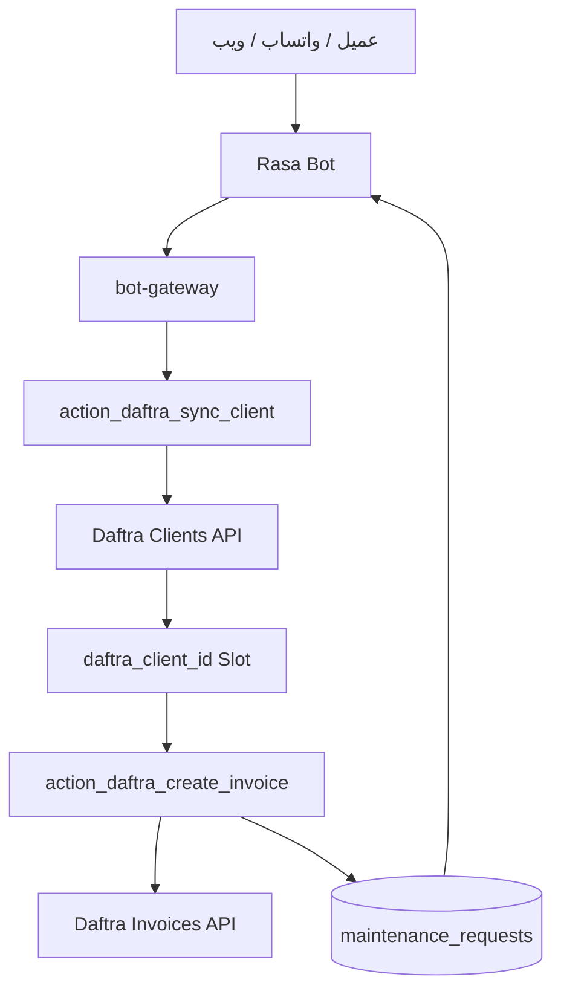

# دليل عمل البوت مع نظام دفترة المحاسبي

> **النطاق:** هذا الملف هو دليل التشغيل العملي لتكامل بوتات مؤسسة العزب مع نظام **دفترة Daftra** من داخل مشروع Rasa، وبالأخص مسار:  
> Rasa Bot → Bot Gateway → Daftra API → قاعدة بيانات طلبات الصيانة.

آخر تحديث: 2026-05-20  
المستودع: `AlazabDev/alazab-rasa`  
الملف التشغيلي المرتبط: `actions/action_daftra_ops.py`

---

## 1. الهدف التنفيذي

الغرض من هذا التكامل هو تمكين البوت من تنفيذ مسارين محاسبيين أساسيين بدون تدخل يدوي كامل:

1. **مزامنة العميل مع دفترة**  
   البحث عن العميل برقم الهاتف، وإن لم يكن موجودًا يتم إنشاؤه تلقائيًا.

2. **إصدار فاتورة مرتبطة بطلب الصيانة**  
   إنشاء فاتورة في دفترة، ثم حفظ رقم الفاتورة ورابطها داخل جدول `maintenance_requests`.

هذا الدليل لا يستبدل وثائق Daftra API الأصلية، لكنه يحوّلها إلى مسار تشغيل واضح خاص ببوتات العزب.

---

## 2. المراجع داخل المشروع

| الملف | الدور |
|---|---|
| `docs/API_GATEWAY_TESTING_COMMANDS.md` | أوامر اختبار دورة حياة طلب الصيانة عبر `maintenance-gateway`. |
| `docs/BOTS_API_INTEGRATION_GUIDE.md` | دليل البوتات الموحد ونقاط النهاية العامة. |
| `docs/daftra-module.md` | هذا الملف: دليل تشغيل تكامل البوت مع دفترة. |
| `actions/action_daftra_ops.py` | كود Rasa Actions الخاص بمزامنة العميل وإصدار الفاتورة. |

---

## 3. الصورة العامة للتكامل



---

## 4. المسارات المعتمدة حاليًا

### 4.1 Bot Gateway

استخدم `bot-gateway` لكل تفاعل صادر من البوت:

```bash
export BOT_GATEWAY="https://zrrffsjbfkphridqyais.supabase.co/functions/v1/bot-gateway"
export BOT_API_KEY="<BOT_API_KEY>"
```

شكل الطلب العام:

```json
{
  "action": "<ACTION_NAME>",
  "payload": {},
  "session_id": "optional-conversation-uuid",
  "metadata": {
    "source": "azabot|uberfix_bot|abuauf_bot",
    "channel": "web|whatsapp|messenger"
  }
}
```

### 4.2 Daftra API

قواعد URL الحالية من وثيقة Daftra الخام:

```bash
export DAFTRA_BASE_URL="https://<subdomain>.daftra.com/api2"
export DAFTRA_ENTITY_V2_URL="https://<subdomain>.daftra.com/v2/api/entity"
```

> لا يتم وضع مفاتيح دفترة أو OAuth داخل ملفات التوثيق أو الكود العام. تستخدم القيم من متغيرات البيئة فقط.

---

## 5. متغيرات البيئة المطلوبة

يجب ضبط هذه القيم على السيرفر أو داخل بيئة التشغيل، وليس داخل Git:

```bash
export BOT_API_KEY="<bot-gateway-api-key>"
export DAFTRA_API_KEY="<daftra-api-key>"
export DAFTRA_BASE_URL="https://<subdomain>.daftra.com/api2"
export DATABASE_URL="<postgres-connection-url>"
```

أسماء المتغيرات المستخدمة داخل الكود الحالي:

| المتغير | الاستخدام |
|---|---|
| `DAFTRA_API_KEY` | يمرر في Header باسم `apikey` عند استدعاء Daftra. |
| `DAFTRA_BASE_URL` | عنوان API الأساسي مثل `/api2`. |
| `DB_CONFIG` | إعدادات اتصال PostgreSQL المستخدمة لتحديث `maintenance_requests`. |

---

## 6. Actions الحالية في Rasa

### 6.1 `action_daftra_sync_client`

الغرض: مزامنة العميل مع دفترة.

المدخلات من Slots:

| Slot | مطلوب | الوصف |
|---|---:|---|
| `user_phone` | نعم | رقم هاتف العميل المستخدم في البحث داخل دفترة. |
| `user_name` | لا | اسم العميل، وإن لم يوجد يستخدم الكود قيمة افتراضية. |

المنطق الحالي:

1. قراءة `user_phone` و `user_name` من Tracker.
2. البحث في دفترة:
   ```http
   GET {DAFTRA_BASE_URL}/clients?phone=<phone>
   ```
3. إذا وجد العميل، يتم استخراج `Client.id`.
4. إذا لم يوجد، يتم إنشاء عميل جديد:
   ```http
   POST {DAFTRA_BASE_URL}/clients
   ```
5. عند النجاح يتم حفظ:
   ```python
   SlotSet("daftra_client_id", client_id)
   ```

الـ payload المستخدم عند إنشاء العميل:

```json
{
  "Client": {
    "first_name": "<user_name>",
    "phone1": "<user_phone>",
    "notes": "تمت الإضافة تلقائياً عبر AzaBot"
  }
}
```

---

### 6.2 `action_daftra_create_invoice`

الغرض: إصدار فاتورة في دفترة وربطها بطلب الصيانة.

المدخلات من Slots:

| Slot | مطلوب | الوصف |
|---|---:|---|
| `daftra_client_id` | نعم | رقم العميل داخل دفترة. |
| `service_item` | لا | اسم الخدمة/البند. إن لم يوجد يستخدم الكود خدمة صيانة عامة. |
| `maintenance_request_id` | لا، لكنه مهم | رقم طلب الصيانة داخل قاعدة البيانات لربط الفاتورة بالطلب. |

المنطق الحالي:

1. التأكد من وجود `daftra_client_id`.
2. إنشاء فاتورة على:
   ```http
   POST {DAFTRA_BASE_URL}/invoices
   ```
3. عند نجاح دفترة ورجوع `code = 202` يتم استخراج `id`.
4. يتم بناء رابط مستند الفاتورة.
5. إذا كان `maintenance_request_id` موجودًا، يتم تحديث جدول `maintenance_requests`:
   ```sql
   UPDATE maintenance_requests
   SET daftra_invoice_id = %s,
       daftra_document_url = %s,
       payment_status = 'pending'
   WHERE id = %s;
   ```
6. يتم حفظ Slots:
   ```python
   SlotSet("daftra_last_invoice_id", invoice_id)
   SlotSet("daftra_document_url", document_url)
   ```

الـ payload الحالي لإنشاء الفاتورة:

```json
{
  "Invoice": {
    "client_id": "<daftra_client_id>",
    "notes": "صادرة عبر AzaBot"
  },
  "InvoiceItem": [
    {
      "item": "<service_item>",
      "quantity": 1,
      "unit_price": 0
    }
  ]
}
```

> ملاحظة تشغيلية مهمة: السعر الحالي `unit_price = 0` في الكود، لذلك إصدار الفاتورة هنا يصلح كمسودة تشغيلية أو فاتورة تحتاج مراجعة محاسب/مصدر أسعار قبل الاعتماد المالي النهائي.

---

## 7. أسماء Actions على مستوى Bot Gateway مقابل Rasa

في دليل البوتات العام تم ذكر أسماء عمليات محاسبية مجردة:

| Bot Gateway Action | Rasa SDK Action | الوظيفة |
|---|---|---|
| `daftra_sync_client` | `action_daftra_sync_client` | مزامنة أو إنشاء العميل في دفترة. |
| `daftra_create_invoice` | `action_daftra_create_invoice` | إنشاء فاتورة وربطها بطلب الصيانة. |

القاعدة:  
البوابة تتعامل بأسماء قصيرة مفهومة خارجيًا، وRasa ينفذ أسماء Actions الكاملة المسجلة داخل `domain.yml`.

---

## 8. دورة العمل المحاسبية المقترحة للبوت

### المرحلة 1 — جمع بيانات العميل

الحد الأدنى المطلوب:

```json
{
  "client_name": "أحمد محمد",
  "client_phone": "+201001234567",
  "service_type": "electrical",
  "description": "طلب صيانة كهرباء داخل فرع",
  "priority": "medium"
}
```

### المرحلة 2 — إنشاء طلب الصيانة

يتم إنشاء الطلب من خلال `bot-gateway` أو `maintenance-gateway` حسب مصدر العملية.

### المرحلة 3 — مزامنة العميل مع دفترة

بعد توفر رقم الهاتف:

```json
{
  "action": "daftra_sync_client",
  "payload": {
    "client_name": "أحمد محمد",
    "client_phone": "+201001234567"
  },
  "metadata": {
    "source": "azabot",
    "channel": "whatsapp"
  }
}
```

النتيجة المتوقعة داخليًا:

```json
{
  "success": true,
  "data": {
    "daftra_client_id": "12345"
  }
}
```

### المرحلة 4 — إصدار الفاتورة

بعد انتهاء العمل أو اعتماد التكلفة:

```json
{
  "action": "daftra_create_invoice",
  "payload": {
    "maintenance_request_id": "<request_uuid>",
    "daftra_client_id": "<daftra_client_id>",
    "service_item": "خدمة صيانة كهرباء",
    "quantity": 1,
    "unit_price": 0
  },
  "metadata": {
    "source": "azabot",
    "channel": "whatsapp"
  }
}
```

النتيجة المتوقعة:

```json
{
  "success": true,
  "data": {
    "daftra_invoice_id": "2415",
    "daftra_document_url": "https://<subdomain>.daftra.com/invoices/view/2415"
  }
}
```

---

## 9. ربط دورة الصيانة بالمحاسبة

المراحل المعتمدة في دورة حياة الصيانة موجودة في `API_GATEWAY_TESTING_COMMANDS.md`، والأهم محاسبيًا:

| مرحلة الصيانة | الإجراء المحاسبي المقترح |
|---|---|
| `submitted` | لا يتم إصدار فاتورة. فقط يتم حفظ الطلب. |
| `triaged` | يمكن مزامنة العميل مع دفترة. |
| `assigned` | لا إجراء محاسبي إلزامي. |
| `scheduled` | لا إجراء محاسبي إلزامي. |
| `in_progress` | لا إصدار فاتورة نهائية. |
| `completed` | تجهيز بيانات الفاتورة بعد اكتمال العمل. |
| `billed` | إصدار/ربط فاتورة دفترة. |
| `paid` | تحديث حالة السداد. |
| `closed` | إغلاق الطلب بعد اكتمال التشغيلي والمالي. |

---

## 10. أوامر اختبار آمنة

### 10.1 اختبار Bot Gateway بدون كشف مفاتيح

```bash
export BOT_GATEWAY="https://zrrffsjbfkphridqyais.supabase.co/functions/v1/bot-gateway"
export BOT_API_KEY="<ضع المفتاح محليًا فقط>"

curl -sS -X POST "$BOT_GATEWAY" \
  -H "x-api-key: $BOT_API_KEY" \
  -H "Content-Type: application/json" \
  -d '{
    "action": "list_services",
    "payload": {},
    "metadata": {"source":"azabot","channel":"cli"}
  }'
```

### 10.2 اختبار مزامنة عميل Daftra من خلال البوت

```bash
curl -sS -X POST "$BOT_GATEWAY" \
  -H "x-api-key: $BOT_API_KEY" \
  -H "Content-Type: application/json" \
  -d '{
    "action": "daftra_sync_client",
    "payload": {
      "client_name": "عميل اختبار",
      "client_phone": "+201001234567"
    },
    "metadata": {"source":"azabot","channel":"cli"}
  }'
```

### 10.3 اختبار إنشاء فاتورة من خلال البوت

```bash
curl -sS -X POST "$BOT_GATEWAY" \
  -H "x-api-key: $BOT_API_KEY" \
  -H "Content-Type: application/json" \
  -d '{
    "action": "daftra_create_invoice",
    "payload": {
      "maintenance_request_id": "<request_uuid>",
      "daftra_client_id": "<daftra_client_id>",
      "service_item": "خدمة صيانة عامة",
      "quantity": 1,
      "unit_price": 0
    },
    "metadata": {"source":"azabot","channel":"cli"}
  }'
```

---

## 11. اختبار Rasa Action Server مباشرة

استخدم هذا الاختبار فقط في بيئة التطوير بعد تشغيل Action Server:

```bash
rasa run actions --debug
```

ثم من جلسة المحادثة:

1. اجمع `user_phone`.
2. اجمع `user_name`.
3. شغّل `action_daftra_sync_client`.
4. تأكد من ظهور `daftra_client_id` في Tracker.
5. شغّل `action_daftra_create_invoice` بعد وجود `maintenance_request_id` و `service_item`.

---

## 12. قواعد الأمان

| القاعدة | القرار |
|---|---|
| مفاتيح Daftra | لا تكتب داخل Markdown أو Git. تستخدم فقط من متغيرات البيئة. |
| مفاتيح Bot Gateway | لا تستخدم في Frontend. تستخدم من الخادم فقط. |
| بيانات العملاء | رقم الهاتف يستخدم للتطابق فقط، ولا يطبع في Logs العامة إلا عند الحاجة التشغيلية. |
| الفواتير | لا تعتمد فاتورة نهائية بسعر `0` إلا لو المقصود إنشاء مسودة فقط. |
| الربط المحاسبي | لا يتم اعتبار الطلب مغلقًا محاسبيًا إلا بعد وجود `daftra_invoice_id` وحالة دفع واضحة. |

---

## 13. حالات الخطأ المتوقعة

| الحالة | السبب المحتمل | الإجراء |
|---|---|---|
| لا يوجد `daftra_client_id` | لم يتم جمع رقم الهاتف أو فشلت مزامنة العميل. | أعد تشغيل `action_daftra_sync_client`. |
| `401 / 403` من Daftra | مفتاح Daftra غير صحيح أو الصلاحية غير كافية. | راجع متغير `DAFTRA_API_KEY` محليًا. |
| `404` من Daftra | `DAFTRA_BASE_URL` غير صحيح أو مسار API غير مطابق. | تحقق من subdomain والمسار `/api2`. |
| فاتورة بدون سعر | الكود الحالي يستخدم `unit_price = 0`. | اربط مصدر الأسعار قبل الاعتماد النهائي. |
| لم يتم تحديث الطلب | `maintenance_request_id` غير موجود أو اتصال DB فشل. | افحص `DB_CONFIG` وسجلات Action Server. |

---

## 14. نقاط تطوير لاحقة مطلوبة

هذه النقاط ليست شرطًا لتشغيل النسخة الحالية، لكنها ضرورية قبل الاعتماد المالي الكامل:

1. ربط `service_item` بمصدر أسعار حقيقي من Product Master Data أو Daftra Products.
2. إضافة `product_id` في `InvoiceItem` بدل الاعتماد على اسم البند فقط.
3. دعم الضرائب والخصومات ووحدة القياس حسب كتالوج العزب.
4. فصل وضع المسودة عن الفاتورة النهائية بحقل واضح مثل `draft: true/false`.
5. إضافة Action لتحديث حالة الدفع من Daftra إلى `maintenance_requests.payment_status`.
6. إضافة اختبارات تكامل تلقائية لمسارات: عميل جديد، عميل موجود، فاتورة ناجحة، فشل مصادقة، فشل DB.

---

## 15. ملخص القرار التشغيلي

- `action_daftra_sync_client` هو أول خطوة محاسبية بعد توفر رقم العميل.
- `action_daftra_create_invoice` لا يتم تشغيله كاعتماد مالي نهائي إلا بعد تحديد السعر.
- `bot-gateway` هو المدخل الخارجي للبوتات.
- `actions/action_daftra_ops.py` هو التنفيذ الحالي داخل Rasa.
- `maintenance_requests` هو مكان حفظ رابط الفاتورة وحالة الدفع داخل نظام العزب.

**هذا الملف هو مرجع العمل الحالي لتكامل بوتات العزب مع دفترة.**
